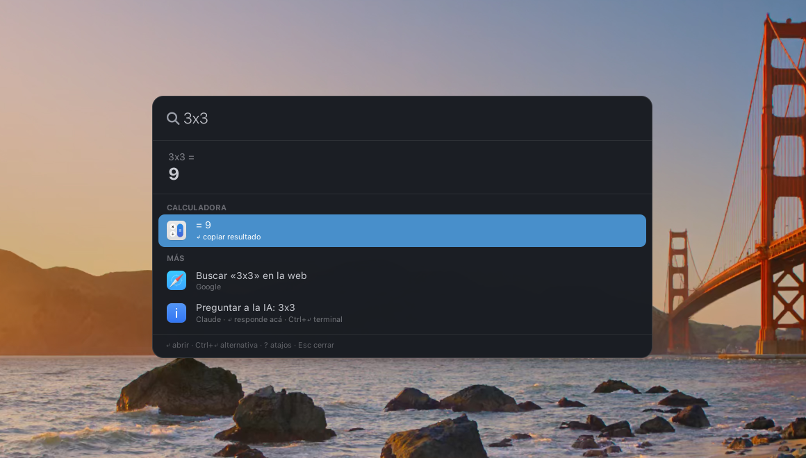
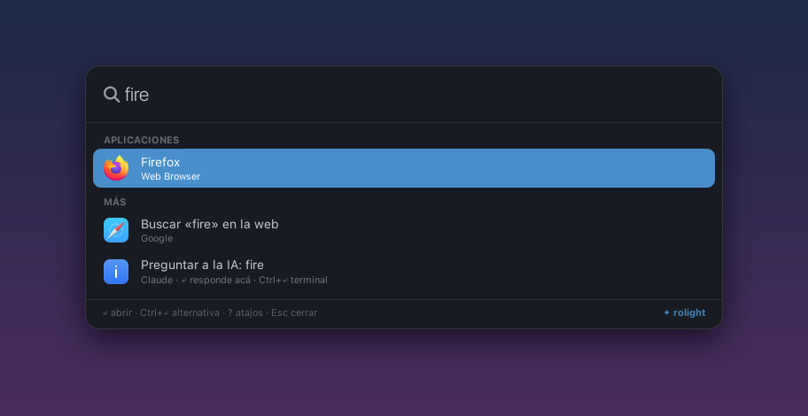
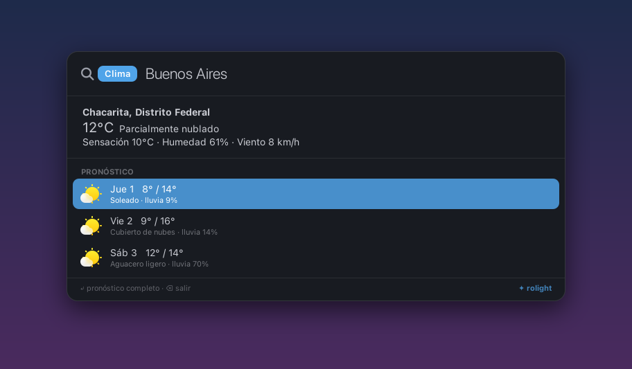
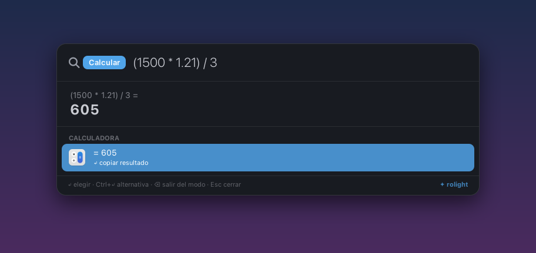
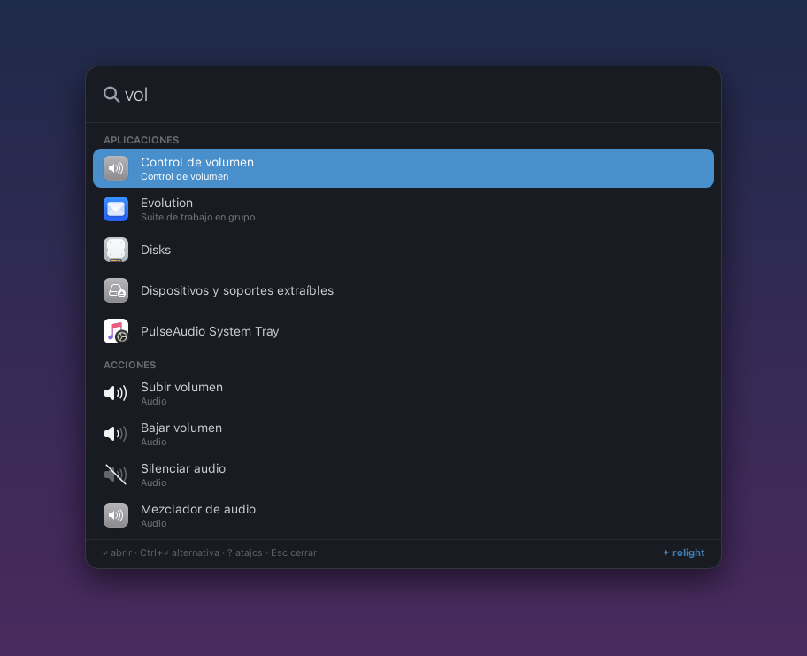
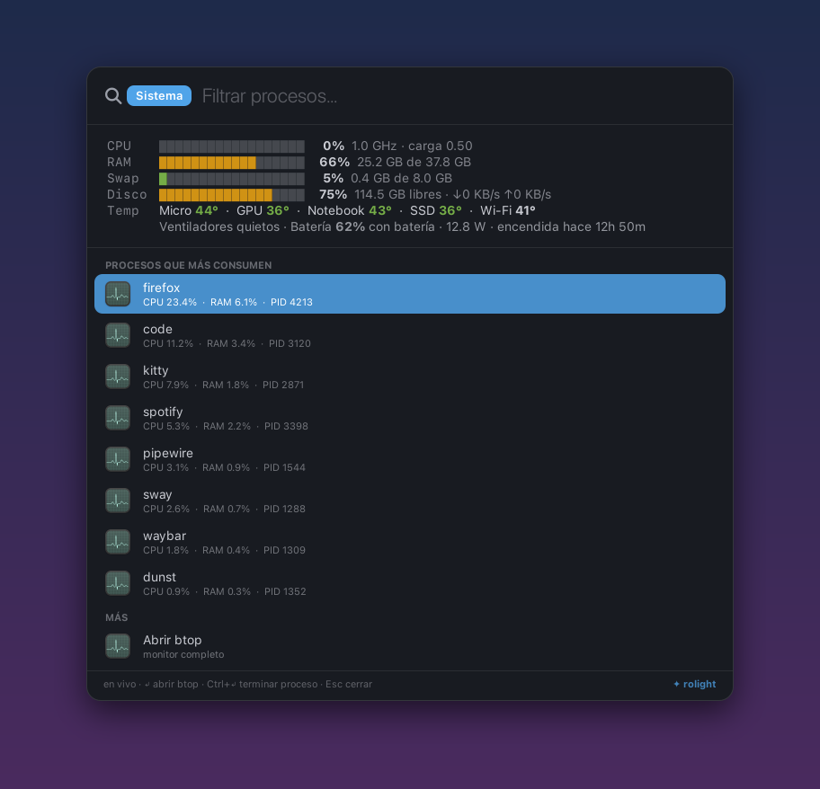
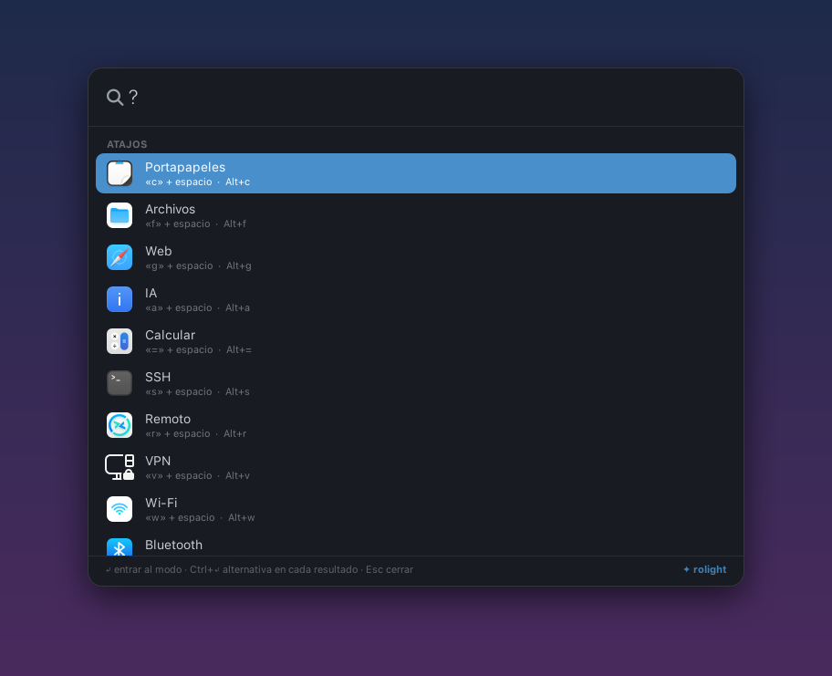
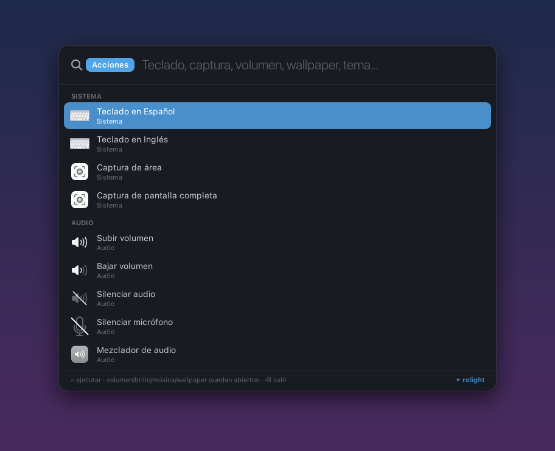
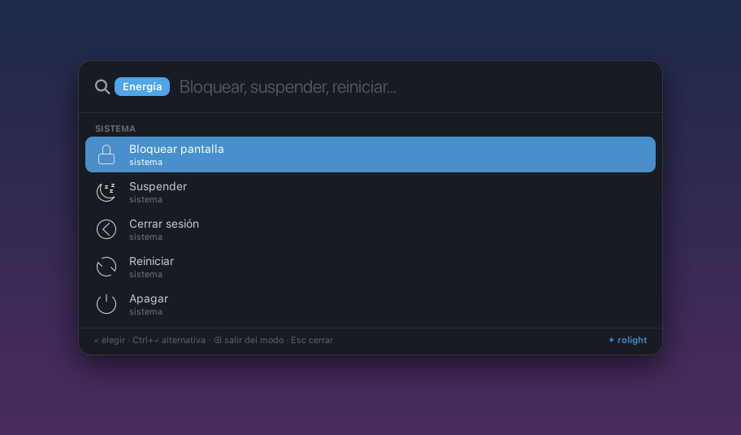
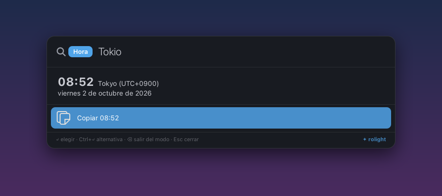

<div align="center">

# ✦ rolight

**Un launcher liviano para tiling window managers.**
Apps, archivos, calculadora, clima, Wi-Fi, Bluetooth, VPN, SSH, contraseñas, procesos y más,
todo desde una sola caja y sin sacar las manos del teclado.




</div>

---

## ¿Por qué rolight?

- **Instantáneo.** Queda residente y se muestra/oculta por D-Bus: no hay arranque en frío cada vez que lo abrís.
- **Liviano.** Python + GTK3, sin Electron ni servicios extra. Los modos pesados (clima, Wi-Fi, archivos)
  corren en segundo plano y nunca congelan la interfaz.
- **Todo en un lugar.** 18 modos con atajo de una letra. Escribís y los resultados se actualizan al vuelo.
- **Sin compilar.** Son scripts: cloná, instalá las dependencias y listo.

## Capturas

| | |
|---|---|
|  |  |
| **Búsqueda** de apps, web e IA | **Clima** con pronóstico de 3 días |
|  |  |
| **Calculadora** (Enter copia el resultado) | **Búsqueda mixta**: apps + acciones a la vez |
|  |  |
| **Sistema** en vivo: CPU, RAM, temperaturas, procesos | **Atajos**: escribí `?` |
|  |  |
| **Acciones** rápidas: volumen, brillo, capturas, wallpaper | **Energía** con confirmación |
|  | |
| **Hora** en cualquier ciudad | |

## Modos

Escribí la letra + espacio (o `Alt+letra`). Con la búsqueda vacía, `Backspace` vuelve al inicio.

| Tecla | Modo | Qué hace | Necesita |
|:---:|---|---|---|
| — | Apps | Lanza aplicaciones, ordenadas por uso | — |
| `c` | Portapapeles | Historial con vista previa; copiar o pegar directo | `copyq`, `wtype` |
| `f` | Archivos | Búsqueda rápida en `$HOME` | `fd` |
| `g` | Web | Busca en el navegador; también abre URLs | — |
| `a` | IA | Pregunta a la IA y responde ahí mismo; Ctrl+↵ sigue la charla en terminal | `opencode` o `claude` |
| `e` | Sesiones IA | Lista y retoma sesiones de Claude Code, OpenCode y Hermes en su carpeta | cualquiera de los tres |
| `=` | Calcular | Calculadora segura | — |
| `s` | SSH | Hosts de `~/.ssh/config` y `known_hosts` | `kitty` |
| `r` | Remoto | Perfiles de escritorio remoto | `remmina` |
| `v` | VPN | Conectar/desconectar VPNs (WireGuard, OpenVPN, OpenConnect…) | `nmcli` |
| `w` | Wi-Fi | Escanear y conectar | `nmcli` |
| `b` | Bluetooth | Conectar/desconectar dispositivos | `bluetoothctl` |
| `m` | Monitores | Aplicar perfiles de pantallas | `kanshi` (sway) |
| `t` | Clima | Clima y pronóstico vía wttr.in | internet |
| `h` | Hora | Hora local o de cualquier ciudad | — |
| `p` | Energía | Bloquear, suspender, cerrar sesión, reiniciar, apagar | `swaylock`, `systemd` |
| `x` | Acciones | Volumen, brillo, media, capturas, wallpaper, teclado | ver abajo |
| `k` | Bitwarden | Buscar y copiar contraseñas | `rbw` |
| `i` | Sistema | CPU, memoria, temperatura, disco, batería, procesos | `btop` (opcional) |

Cada modo solo usa su herramienta si la tenés: si falta, ese modo no anda, pero el resto sí.

La tabla de arriba es de la **versión GTK** (Wayland). En la **versión rofi** (X11)
llegan escribiendo letra + espacio: Portapapeles, Bluetooth, Wi-Fi, VPN, Bitwarden,
Sesiones IA y Sistema. Las que no existen ahí son **Monitores** y **Acciones**
(volumen, brillo, capturas), porque dependen de `swaymsg`/`kanshi`. Está detallado
en la [sección de i3](#configuración-por-window-manager).

---

## Compatibilidad

rolight trae **dos interfaces** que comparten la misma lógica:

- **`rolight`**: la versión principal, ventana GTK3 flotante con `gtk-layer-shell`.
  Necesita un compositor **Wayland con soporte de layer-shell**.
- **`rolight-rofi`**: la versión alternativa sobre **rofi**. Anda en **X11 y en Wayland**.

| Entorno | Versión recomendada | Estado |
|---|---|---|
| **sway** | `rolight` | ✅ Todo funciona (es donde se desarrolla) |
| **Hyprland** | `rolight` | ✅ Funciona. El modo Monitores y las acciones de teclado son de sway |
| **river, niri, labwc, Wayfire** | `rolight` | ✅ Layer-shell soportado; mismas salvedades que Hyprland |
| **KDE Plasma (Wayland)** | `rolight` | 🟡 KWin soporta layer-shell; sin probar a fondo |
| **i3 / bspwm / Openbox (X11)** | `rolight-rofi` | 🟡 La versión rofi anda; la GTK no (layer-shell es solo Wayland) |
| **GNOME** | `rolight-rofi` | 🟡 Mutter no soporta layer-shell: usá la versión rofi |

> Lo único atado a sway: el modo **Monitores** (kanshi + `swaymsg`), las acciones de
> **teclado** y **recargar sway**. Cerrar sesión detecta solo sway, Hyprland, i3 o cualquier sesión de systemd.

---

## Instalación

No hay nada que compilar: rolight son scripts de Python y Bash.

### 1. Cloná el repo

```sh
git clone https://github.com/ldgnu/rolight.git ~/.config/rolight
mkdir -p ~/.local/bin
ln -s ~/.config/rolight/rolight ~/.local/bin/rolight
ln -s ~/.config/rolight/rolight-rofi ~/.local/bin/rolight-rofi
```

> Asegurate de que `~/.local/bin` esté en tu `PATH`. Si preferís otra carpeta, el lanzador se ubica solo.

### 2. Instalá las dependencias

<details open>
<summary><b>Arch Linux / Manjaro / EndeavourOS</b></summary>

```sh
# base (obligatorio)
sudo pacman -S --needed python python-gobject gtk3 gtk-layer-shell wl-clipboard libnotify

# opcionales según los modos que uses
sudo pacman -S --needed fd networkmanager bluez-utils kanshi copyq wtype kitty \
    swaylock playerctl brightnessctl libpulse btop rbw remmina flameshot rofi

# fuentes e íconos (opcional, para el look de las capturas)
sudo pacman -S --needed ttf-jetbrains-mono-nerd
yay -S whitesur-icon-theme otf-apple-sf-pro      # desde AUR
```

En **i3 u otro X11** no instalés `gtk-layer-shell` ni `wtype` (son Wayland); la
versión GTK no anda ahí. Agregá lo que usa la versión rofi:

```sh
sudo pacman -S --needed xclip xdotool i3lock       # o xsel
```
</details>

<details open>
<summary><b>Ubuntu / Debian / Pop!_OS</b></summary>

```sh
# base (obligatorio)
sudo apt install python3 python3-gi gir1.2-gtk-3.0 gir1.2-gtklayershell-0.1 wl-clipboard libnotify-bin

# opcionales según los modos que uses
sudo apt install fd-find network-manager bluez kanshi copyq wtype kitty \
    swaylock playerctl brightnessctl pulseaudio-utils btop remmina flameshot rofi

# rbw (Bitwarden) no está en apt:
cargo install rbw
```

En **X11** (i3, GNOME en Xorg): `sudo apt install xclip xdotool i3lock`. La
versión GTK necesita layer-shell, que es solo Wayland.

> En Ubuntu `fd` se llama `fdfind`: rolight lo detecta solo.
</details>

<details>
<summary><b>Fedora</b></summary>

```sh
sudo dnf install python3-gobject gtk3 gtk-layer-shell wl-clipboard libnotify \
    fd-find NetworkManager bluez kanshi copyq wtype kitty swaylock playerctl brightnessctl btop rofi
```
</details>

<details>
<summary><b>X11 (i3, GNOME en Xorg, etc.)</b></summary>

Para la versión rofi en X11 además necesitás `xclip` (en lugar de `wl-clipboard`):

```sh
sudo pacman -S xclip rofi      # Arch
sudo apt install xclip rofi    # Ubuntu
```
</details>

**Fuentes e íconos:** el estilo usa *SF Pro Display*, *JetBrainsMono Nerd Font* y el tema de íconos
*WhiteSur-dark*. Si no los tenés, GTK usa los de tu sistema y funciona igual.

### 3. Probalo

```sh
rolight          # abre / cierra
rolight calc     # abre directo en un modo (clip, wifi, bt, power, monitor, vpn, ...)
```

---

## Configuración por window manager

La idea es siempre la misma: **arrancar el daemon al iniciar sesión** (para que abra al instante) y
**asignar un atajo**. La ventana de la IA y el clima completo usan la clase `rolight-ai`: conviene que flote.

<details open>
<summary><b>sway</b> — <code>~/.config/sway/config</code></summary>

```sway
exec rolight --daemon

bindsym $mod+d      exec rolight
bindsym $mod+c      exec rolight clip
bindsym $mod+n      exec rolight wifi
bindsym $mod+b      exec rolight bt
bindsym $mod+Escape exec rolight power

for_window [app_id="rolight-ai"] floating enable, resize set 960 640, move position center
```
</details>

<details>
<summary><b>Hyprland</b> — <code>~/.config/hypr/hyprland.conf</code></summary>

```ini
exec-once = rolight --daemon

bind = SUPER, D,      exec, rolight
bind = SUPER, C,      exec, rolight clip
bind = SUPER, N,      exec, rolight wifi
bind = SUPER, B,      exec, rolight bt
bind = SUPER, Escape, exec, rolight power

windowrulev2 = float,         class:^(rolight-ai)$
windowrulev2 = size 960 640,  class:^(rolight-ai)$
windowrulev2 = center,        class:^(rolight-ai)$

# opcional: desenfoque detrás del panel
layerrule = blur, rolight
```
</details>

<details>
<summary><b>i3</b> (X11, versión rofi) — <code>~/.config/i3/config</code></summary>

```i3
bindsym $mod+d exec --no-startup-id rolight-rofi
# Sin esto i3 tilea a pantalla completa las terminales que abre rolight.
for_window [class="rolight-ai"] floating enable, resize set 960 640, move position center
```

No hace falta daemon ni autostart: la versión rofi abre y cierra al vuelo.

**Modos por prefijo.** La versión rofi no tiene teclas de modo como la GTK: se
escriben en el lanzador letra + espacio y se pulsa Enter.

| Escribís | Modo |
| --- | --- |
| `c algo` | Portapapeles (historial de `copyq`, Enter copia, *Pegar* en la ventana activa) |
| `b algo` | Bluetooth (`bluetoothctl`) |
| `w algo` | Wi-Fi (`nmcli`) |
| `v algo` | VPN: **Tailscale** si está, si no los perfiles de `nmcli` |
| `k algo` | Bitwarden (`bw` o `rbw`) |
| `e algo` | Sesiones IA de Claude Code, OpenCode y Hermes |
| `i` | Sistema: CPU, RAM, swap, disco, temperaturas, ventiladores |
| `i p algo` | Procesos, filtrables por nombre (`psutil`) |
| `f algo` o `/algo` | Archivos (`fd`) |
| `g algo` | Web · `ssh host` · `rdp host` · `clima` · `hora en …` |

**Tailscale** (`v`): Tailscale no aparece como perfil VPN en NetworkManager
(es un dispositivo tun), así que sin esto el tailnet entero sería invisible. Muestra
tu hostname, IP, los equipos conectados con su estado, y permite conectar o
desconectar. Como `up`/`down` escriben en el socket de root, reintenta con
`sudo -n` si hace falta (no queda esperando una contraseña dentro de un menú).
Definí `ROLIGHT_TAILSCALE_WEB` si usás una instancia self-hosted o headscale.

**Sistema** (`i`): lee `/proc` y `sensors(1)`, así que no necesita nada instalado.
Con `psutil` además muestra los procesos con CPU real por proceso, y avisa cuando
el disco pasa de 90 %.

Si tu rice ya tiene TUI para algo (bluetuith, nmtui…), esos modos igual ofrecen
abrirlo: no se duplica la lógica, se delega.

Dos variables de entorno opcionales:

- `ROLIGHT_FIND_HIDDEN=1` — que la búsqueda de archivos entre también en carpetas
  ocultas (`~/.config`, `~/.ssh`…). Por default está **off**, porque `fd` las
  ignora y activarlo cambia los resultados.
- `ROLIGHT_LOCK_CMD` — fuerza el locker: `i3lock -i ~/wall.png`, por ejemplo. Sin
  esto se usa `~/.config/i3/scripts/lock.sh` si existe, si no `i3lock` o
  `xsecurelock`.

Para el bloqueo en X11 hace falta `xclip` (o `xsel`) y `xdotool`; el historial del
portapapeles usa `copyq`.
</details>

<details>
<summary><b>GNOME</b> (versión rofi)</summary>

GNOME no tiene archivo de atajos: se agregan con `gsettings` (o desde
*Configuración → Teclado → Atajos personalizados*):

```sh
KEY=/org/gnome/settings-daemon/plugins/media-keys/custom-keybindings/rolight/
gsettings set org.gnome.settings-daemon.plugins.media-keys custom-keybindings "['$KEY']"
gsettings set org.gnome.settings-daemon.plugins.media-keys.custom-keybinding:$KEY name 'rolight'
gsettings set org.gnome.settings-daemon.plugins.media-keys.custom-keybinding:$KEY command "$HOME/.local/bin/rolight-rofi"
gsettings set org.gnome.settings-daemon.plugins.media-keys.custom-keybinding:$KEY binding '<Super>space'
```

> Ojo: el primer comando reemplaza tus atajos personalizados existentes. Si ya tenés, agregá
> `'$KEY'` a la lista actual (`gsettings get org.gnome.settings-daemon.plugins.media-keys custom-keybindings`).
</details>

<details>
<summary><b>river / niri / labwc / Wayfire</b></summary>

Arrancá `rolight --daemon` en el autostart de tu compositor y asigná `rolight` a una tecla.
Cualquier compositor con `wlr-layer-shell` sirve.
</details>

---

## Personalización

| Qué | Dónde |
|---|---|
| Terminal, buscador web, ciudad del clima | arriba de todo en `core.py` |
| IA: `opencode` o `claude` | `AI_BACKEND` en `core.py` |
| Acciones rápidas (modo `x`) | lista `ACTIONS` en `rolight.py` |
| Colores, tamaños y fuentes | bloque `CSS` en `rolight.py` |
| Ancho del panel | `WIDTH` en `rolight.py` |
| Tema de la versión rofi | `rolight.rasi` |
| Imagen de la pantalla de bloqueo | `~/.config/rolight/lock.png` o la variable `ROLIGHT_LOCK_IMAGE` |

### Personalizaciones propias (`local.py`)

Si creás `~/.config/rolight/local.py`, rolight lo carga al arrancar y git lo ignora: sirve para cambios
tuyos que no querés subir. Tiene que exponer `setup(r)`, donde `r` es el módulo de rolight:

```python
def setup(r):
    # sumar una acción al modo x
    r.ACTIONS.append(("Abrir Obsidian", "notas obsidian", "obsidian", "obsidian", "Apps", False))
    # o reemplazar un modo entero: r.Rolight.mode_vpn = mi_mode_vpn
```

Algunas acciones del modo `x` llaman a scripts propios en `~/.scripts/` (historial de notificaciones,
selector de tema): reemplazalas por las tuyas o borralas.

## Archivos

```
rolight         lanzador: muestra/oculta por D-Bus o arranca el daemon
rolight.py      interfaz GTK3 + layer-shell (versión principal)
core.py         lógica compartida; también es el script de modo para rofi
rolight-rofi    lanzador de la versión rofi
rolight.rasi    tema de rofi
```

Historial y caché: `~/.cache/rolight/` · Log: `~/.cache/rolight/rolight.log`

## Licencia

[MIT](LICENSE) © Javi Solis
